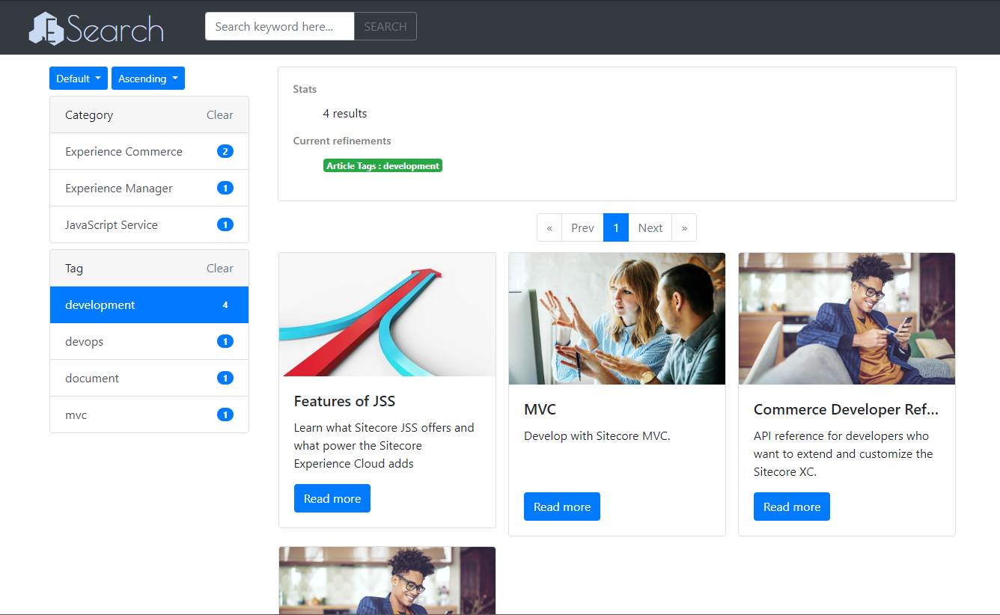
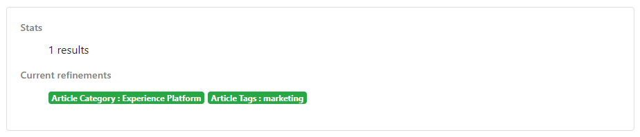
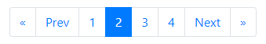
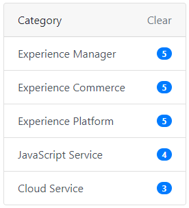

## ESearch
  

ESearch is a simple search module for Sitecore XP. This project is created as a submission for "[konabos Search UI Competition](https://www.konabos.com/search-ui-competition)".  

**Warning: This software is in the beta stage.**

## Prerequisites
- Sitecore Experience Platform 9.2

## Installation
1. Download the package `ESearch-{version}.zip` from the release page.
1. Install the package to your Sitecore via Installation Wizard.

### Sample Website
ESearch provides a sample website build with this module & Bootstrap 4.

  

To install the sample website:  

1. Install `ESearch - Sample Website-{version}.zip` (available in the release page)
1. Rebuild `sitecore_master_index`
1. Add a bind `esearch.example.com:80` to your site on IIS
1. Add a DNS record `127.0.0.1 esearch.example.com` to the `hosts` file
1. Access to `http://esearch.example.com` and enjoy!

## Usage

---

**NOTE**

You can see how to use this module on YouTube.

- [How to use ESearch](https://www.youtube.com)

---

This module contains the following components.

- <a href="#search-results">Search Results</a>
- <a href="#search-result-summary">Search Result Summary</a>
- <a href="#page-selector">Page Selector</a>
- <a href="#facet-filter">Facet Filter</a>
- <a href="#sort-indicator">Sort Indicator</a>
- <a href="#search-box">Search Box</a> (supports typeahead suggestion)

These components contain the CSS classes based on the Bootstrap 4, but it's not required. You can use your own styles if you want.  

All components need to set a `Search Settings` item in the rendering parameter. The `Default Search Settings` is used by default.

- `Search Settings`:
  - /sitecore/templates/Foundation/ESearch/Search Settings
- `Default Search Settings`:
  - /sitecore/system/Settings/ESearch/Search Settings/Default Search Settings

The `Search Settings` has the following search options.

|Field name|Description|
|:-|:-|
|`Scope`|The root item for filtering the search results.|
|`Target templates`|The tempaltes for filtering the search results.|
|`Page Size`|The number of items displayed in search results component per page.|
|`Keyword Search Targets`|The fields used in the keyword search. This affects search performance, so less is better.|
|`Date Format`|The date format used for displaying date.|

### Search Results
The search results component shows the result items of searching.  

A result item uses the `Search Result Data` template for displaying its information. Set this template to your page templates' `Base template` field.  

- /sitecore/templates/Feature/ESearch/Search Result Data

#### Datasource Template
- Path: /sitecore/templates/Feature/ESearch/Search Results

|Field name|Description|
|:-|:-|
|Read More Label|A text displayed on the "Read more" link in each result item.|

#### Rendering Parameters
- Path: /sitecore/templates/Feature/ESearch/Rendering Parameter/Search Results Parameters

|Parameter name|Description|
|:-|:-|
|Item Css Class|A class name that set to each result item.|

### Search Result Summary
The Search Result Summary component shows the count of result and current search conditions.  
Search conditions are not displayed by default.

#### Datasource Template
- Path:	/sitecore/templates/Feature/ESearch/Search Result Summary/Search Result Summary 

|Field name|Description|
|:-|:-|
|Total Count Label|The text displayed on the title of count of result.|
|Search Conditions Label|The text displayed on the title of current search conditions.|

### Page Selector
The page selector component shows the link list for a pagination.

#### Datasource Template
- Path: /sitecore/templates/Feature/ESearch/Search Results

|Field name|Description|
|:-|:-|
|Previous Link Label|The text displayed on the link to the previous page.|
|Next Link Label|The text displayed on the link to the next page.|
|First Link Label|The text displayed on the link to the first page. If the text is empty, the link is hidden.|
|Last Link Label|The text displayed on the link to the last page. If the text is empty, the link is hidden.|

#### Rendering Parameters
- Path: /sitecore/templates/Feature/ESearch/Rendering Parameter/Search Results Parameters

|Parameter name|Description|
|:-|:-|
|Selector Size|The number of the page selector links displayed on both sides of a center link.|

### Facet Filter
The facet filter component shows the number of search results in a specific field.

#### Datasource Template
- Path: /sitecore/templates/Feature/ESearch/Search Results

|Field name|Description|
|:-|:-|
|Header Label|The text displayed on the header of the filter.|
|Clear Label|The text displayed on the clear button.|

#### Rendering Parameters
- Path: /sitecore/templates/Feature/ESearch/Rendering Parameter/Search Results Parameters

|Parameter name|Description|
|:-|:-|
|Target Field|The field for calculating the number of search results.|
|||

### Sort Indicator
The sort indicator shows displays two drop-down lists for sorting the search results.

#### Sort field drop-down list
This drop-down list choices are set in the data source item of the sort indicator component.

#### Sort direction drop-down list
This drop-down list has only ascending or descending choices.

#### Datasource Template
- Path: /sitecore/templates/Feature/ESearch/Sort Indicator

|Field name|Description|
|:-|:-|
|Sort Fields|Select `Sort Field` items displayed on the drop-down list.|
|Default Text|The text to displayed on the initial choice in the drop-down list.|

`Sort Field`:
  - /sitecore/templates/Feature/ESearch/Sort Field

|Field name|Description|
|:-|:-|
|Field Name|The name of the field of the search target content.|
|Display Name|The name of display on drop-down list.|

### Search Box
The search box is a component that helps the keyword search and provides suggestions.  

You can search for the field that set in `Keyword Search Target` in` Search Settings`. If you want to use the suggestions function, you need to load `esearch.searchbox.js`.

#### Rendering Parameters
- Path: /sitecore/templates/Feature/ESearch/Rendering Parameter/Search Box Parameters  

|Parameter name|Description|
|:-|:-|
|Max Length|The maximum number of characters a user can manually type into the TextBox.|

#### Datasource Template
- Path: /sitecore/templates/Feature/ESearch/Search Box

|Field name|Description|
|:-|:-|
|Placeholder Label|A text for display in the placeholder.|
|Execute Button Label|A text for display on the button that executes search.|

## Todos
The features below are not supported yet.

- [ ] Asynchronous update of the search results
- [ ] A range-based filter (ex: filter by price, date, etc.)
- [ ] Adding the components beyond a search page
- [ ] SXA Integrations

Your contribution and a feedback like below are very welcome.

- Make a feature in todo list
- Fix English in the documents or comments
- Improve performance
- Add a sample theme without the Bootstrap
- Add a compatible rendering for each component

## License
This software is released under the MIT License, see LICENSE.txt.

## Authors
- Ayane Suzuki
- Takumi Yamada (xirtardauq@gmail.com)
- Yuta Tsunemoto